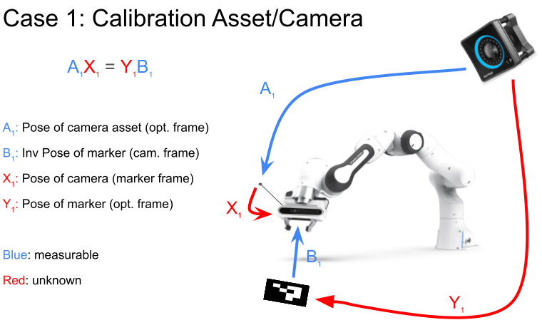
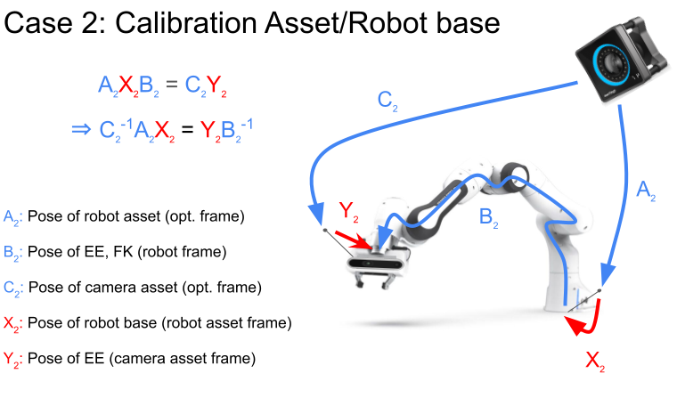

# hand_eye_calibration
This repository presents a comprehensive solution to the hand-eye calibration problem, a fundamental challenge in robotics and computer vision. Hand-eye calibration is critical for applications requiring precise alignment between the coordinate system of a robotic manipulator (the 'hand') and a vision system (the 'eye').

<div align="center">
    
    
</div>

## Table of Contents

- [Installation](#installation)
- [Usage](#usage)

## Installation

Steps to install your project:

1. **Clone the Repository:**
   ```bash
   git clone https://github.com/epfl-lasa/hand_eye_calibration.git
   ```
2. **Build and start docker image:**
   ```bash
   cd hand_eye_calibration/docker
   bash build.sh
   bash start.sh
   ```
3. **Compile the project:**
   
   Since the src folders are imported as a volume in docker for now, do not forget to build the project
   ```bash
   catkin_make
   ```
## Usage

1. **Camera:**
  
   If you are using a realsense camera you can just start a node using the given bash file
   ```bash
   bash src/scripts/camera.sh
   ```
2. **Marker detection:**
  
   Verify that the topic names in /src/aruco_ros/aruco_ros/launch/single.launch corresponds to the topics the camera is publishing and run the marker detection with the following script

   Link for markers: https://chev.me/arucogen/

   In the following bash script change the markerId and markerSize corresponding to you print: 
   ```bash
   bash src/scripts/marker.sh
   ```
   <div align="center">
    
  </div>

  3. **Optitrack:**

     Refer to [https://github.com/bonato47/Optitrack_ROS2](https://github.com/bonato47/Optitrack_ROS2/tree/main/ros1_ws) to publish the pose of your camera and change the topic name in src/scripts/gather.py accordingly

  4. **Data recording:**
     
     In order to record the data with a franka panda you can use the branch "calibration" of the repo: [https://github.com/epfl-lasa/panda-task-control/tree/calibration] to move the robotic arm to 64 different position and to send the data to the gathering process. First start the following script to gather the data and save it correctly:
     
     ```bash
     python3 src/scripts/gather.py
     ```
     Once the data of a pose has been recorded the calibration script will move to the next position. Mathematicaly a minimum of 3 pose are required, by default n=64, the pose are then saved as .npy files
     
  6. **Data processing:**
     ```bash
     python3 src/scripts/process.py
     ```
     The results are shown in both PoseStamped and SE(3) for X1, X2 
