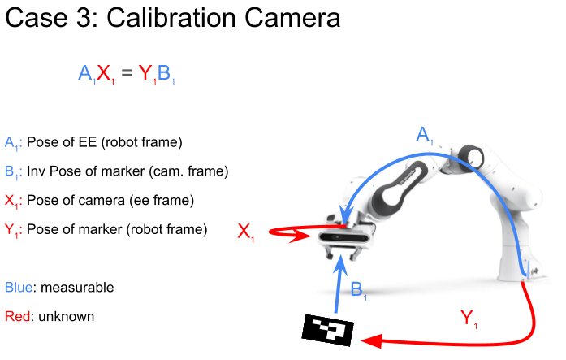

# hand_eye_calibration
This repository presents a comprehensive solution to the hand-eye calibration problem, a fundamental challenge in robotics and computer vision. Hand-eye calibration is critical for applications requiring precise alignment between the coordinate system of a robotic manipulator (the 'hand') and a vision system (the 'eye').

<div align="center">
    
</div>

## Table of Contents

- [Installation](#installation)
- [Usage](#usage)

## Installation

Steps to install your project:

1. **Clone the Repository:**
   ```bash
   git clone https://github.com/epfl-lasa/hand_eye_calibration.git
   git submodule update --init --recursive
   ```
2. **Build and start docker image:**
   ```bash
   cd hand_eye_calibration/docker
   bash build.sh
   bash start.sh
   ```
3. **Compile the project:**
   
   Since the src folders are imported as a volume in docker for now, do not forget to build the project
   ```bash
   catkin_make
   ```
## Usage

1. **Camera:**
  
   If you are using a realsense camera you can just start a node using the given bash file
   ```bash
   bash src/scripts/camera.sh
   ```
2. **Marker detection:**
  
   Verify that the topic names in /src/aruco_ros/aruco_ros/launch/single.launch corresponds to the topics the camera is publishing and run the marker detection with the following script

   Link for markers: https://chev.me/arucogen/

   In the following bash script change the markerId and markerSize corresponding to you print: 
   ```bash
   bash src/scripts/marker.sh
   ```
   <div align="center">
    
  </div>

3. **Data recording:**
     
     In order to record the data with a franka panda you can use the branch "calibration" of the repo: [https://github.com/epfl-lasa/panda-task-control/tree/calibration] to move the robotic arm to different poses and to send the data to the recording process. First start the following script to recording the data and save it correctly:
     
     ```bash
     python3 src/scripts/record.py
     ```
     Once the data of a pose has been recorded the calibration script will move to the next position. Mathematicaly a minimum of 3 pose are required, by default nt = 5<sup>3</sup> (5 for each axis) an nr = 2 (two Z axis rotation per position), the pose are then saved as .npy files

4. **Data processing:**
   
     ```bash
     python3 src/scripts/process.py
     ```
     The matrices X1 and Y1 are saved as .npy file
     
     An error metric will be printed, here you have some comparison values for a good calibration previously done:

        | Error Type | Case 1 Values | Case 2 Values |
        |------------|---------------|---------------|
        | Total Error | 0.0013 | 0.0012 |
        | Rotation Error X | 0.432 deg | 0.165 deg |
        | Rotation Error Y | 0.336 deg | 0.376 deg |
        | Rotation Error Z | 0.499 deg | 0.504 deg |
        | Translation Error X | 2.54 mm | 3.48 mm |
        | Translation Error Y | 0.88 mm | 3.96 mm |
        | Translation Error Z | 2.58 mm | 5.85 mm |

5. **Calibration testing:**
   
    It's important to understand that a small error does not automatically imply a successful calibration. It merely indicates that, based on the provided sets of Ai and Bi, the estimated Xi and Yi are sufficiently accurate. The calibration's quality also depends significantly on the variation in the poses. To evaluate your calibration quality in the first scenario, execute the script provided below. This script publishes a PoseStamped message detailing the error in the Object Frame (B1 X1<sup>-1</sup> A1<sup>-1</sup> Y1).
     
   
     ```bash
     python3 src/scripts/test.py
     ```
     
   Reposition the robot arm into its extreme poses, ensuring the marker remains within the camera's field of view (without moving the marker). This is to verify that the published error remains minimal for poses beyond the calibrated volume's boundaries.

   Otherwise you can test by publishing the pointcloud and orient the EE to point to the base of the robot. The base should match the origin if X is correct.

     ```bash
     python3 src/scripts/test_pointcloud.py
     ```
